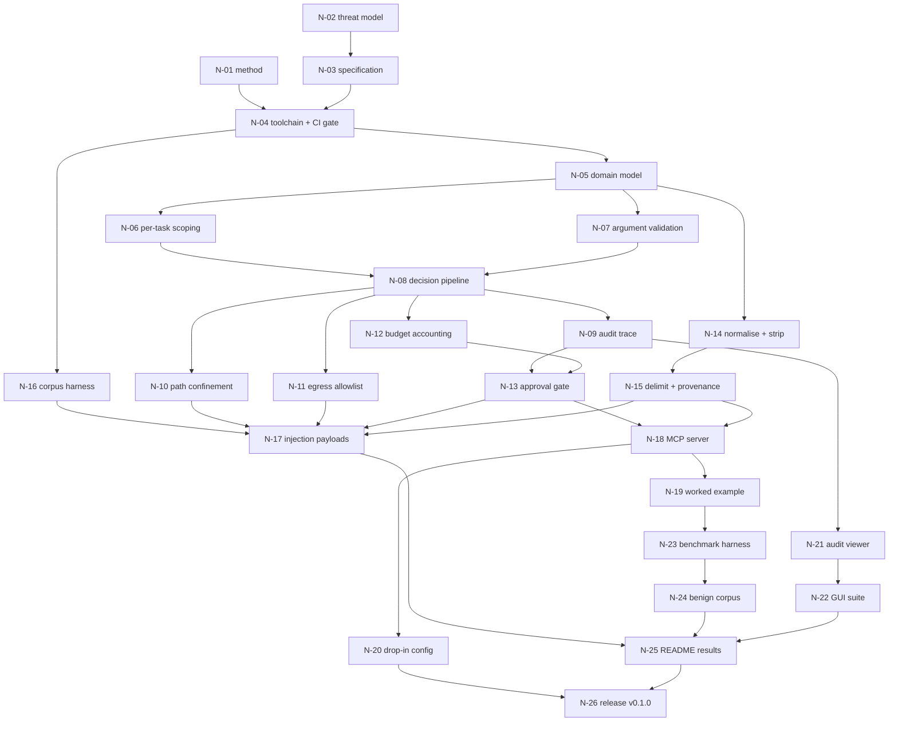
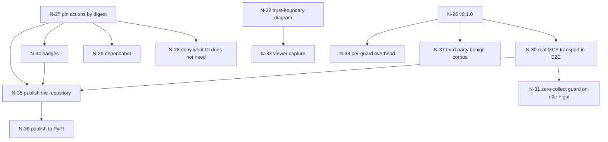

# Roadmap

**Nodes N-01 to N-26 merged, `v0.1.0` released.** Phase 8 (N-27 to N-38) is
open: it closes gaps found by auditing the shipped repository rather than by
adding features.

Work is a directed acyclic graph of nodes, not a list. Phases below are a
readable projection of the graph; the graph is what governs sequencing. See
[`docs/WORKING_METHODS.md`](docs/WORKING_METHODS.md) §2.

Each node declares its owner role, dependencies, the structural invariant it
upholds, its exit condition, and the test tiers required to close it. A node
whose exit condition cannot be stated is not ready to start.

**Legend** — Tests: `U` unit · `A` adversarial · `E` end-to-end · `G` GUI ·
`n/a` recorded as not applicable with a reason.

---

## Dependency graph

### Phase 8 dependency graph

---

## Phase 0 — Foundation

Exit criterion for the phase: the repository survives a senior review before a
single feature exists, and the project's own SAST returns zero high-severity
findings against itself.

### N-01 — Establish the engineering method
- **Owner** Technical lead · **Depends on** — · **Invariant** none
- **Exit** Method, branch policy, role accountability, and the three test tiers
  are written and merged before any feature branch is cut.
- **Tests** n/a — documentation node, no executable behaviour.
- [x] Merged

### N-02 — Threat model and decision records
- **Owner** Security engineer · **Depends on** — · **Invariant** defines I1–I4
- **Exit** STRIDE over the agent loop, trust boundaries, an attack table where
  every row is committed to a corpus payload, accepted residual risk, and four
  ADRs covering the load-bearing decisions.
- **Tests** n/a — documentation node.
- [x] Merged

### N-03 — Normative specification
- **Owner** Technical lead · **Depends on** N-02 · **Invariant** none
- **Exit** Every functional requirement traces to an invariant or an ADR; the
  verification matrix maps each requirement group to its test tiers.
- **Tests** n/a — documentation node.
- [x] Merged

### N-04 — Toolchain and blocking CI gate
- **Owner** Test engineer · **Depends on** N-01, N-03 · **Invariant** none
- **Exit** `make check` and CI run the same gate: format, lint, type check,
  unit with coverage threshold, adversarial as a **separate** step that fails on
  zero-collect or skip, SAST, dependency audit, secret scan. All blocking.
- **Tests** U (the zero-collect guard is itself tested) · A n/a · E n/a ·
  G n/a — no interface at this node.
- [x] Merged

---

## Phase 1 — Broker core

Exit criterion: a proposed call for an out-of-scope tool cannot reach a
handler, and the refusal is attributable from the trace alone.

### N-05 — Domain model
- **Owner** Broker engineer · **Depends on** N-04 · **Invariant** I1
- **Exit** `Task`, `Tool`, `ProposedCall`, `Decision`, `Caps` implemented as
  immutable types. Constructing a `Task` after the loop starts is impossible by
  type, not by convention.
- **Tests** U · A n/a · E n/a · G n/a — no interface.
- [x] Merged

### N-06 — Tool registry and per-task scoping
- **Owner** Broker engineer · **Depends on** N-05 · **Invariant** I1
- **Exit** Out-of-scope tools are absent from both the model-facing schema and
  the dispatch table. A scope naming an unregistered tool fails construction
  closed. Zero-tool scope is legal. (FR-001…FR-005)
- **Tests** U · A · E · G n/a — no interface.
- [x] Merged

### N-07 — Argument schema validation
- **Owner** Broker engineer · **Depends on** N-05 · **Invariant** I3
- **Exit** Validation precedes budget accounting; all downstream checks and the
  audit record consume post-validation arguments. (FR-006…FR-008)
- **Tests** U · A · E · G n/a.
- [x] Merged

### N-08 — Decision pipeline and refusal reasons
- **Owner** Broker engineer · **Depends on** N-06, N-07 · **Invariant** I1, I3
- **Exit** Ordered, deterministic check pipeline emitting a stable
  machine-readable reason. Identical task and call yield an identical decision.
  No model call on this path. (FR-023, FR-024, NFR-002)
- **Tests** U · A · E · G n/a.
- [x] Merged

### N-09 — Append-only audit trace
- **Owner** Broker engineer · **Depends on** N-08 · **Invariant** I3
- **Exit** Every proposed call is recorded, refusals included, with task id,
  post-validation arguments, ordered checks, decision, reason, and outcome. The
  store exposes no mutation or deletion path. (FR-021, FR-022)
- **Tests** U · A n/a — attribution is not itself an attack surface here · E ·
  G deferred to N-22.
- [x] Merged

---

## Phase 2 — Confinement and bounding

Exit criterion: a fully steered agent cannot leave the root, reach an unlisted
host, or exceed its caps without failing closed.

### N-10 — Filesystem path confinement
- **Owner** Security engineer · **Depends on** N-08 · **Invariant** I4
- **Exit** Symlinks and relative segments resolved *before* the confinement
  check; refusal occurs before any file handle opens. String pattern-matching
  is not the mechanism. (FR-009, FR-011)
- **Tests** U · A · E · G n/a.
- [x] Merged

### N-11 — Egress allowlist
- **Owner** Security engineer · **Depends on** N-08 · **Invariant** I4
- **Exit** Host checked against the post-validation destination; refusal
  precedes socket creation. (FR-010, FR-011)
- **Tests** U · A · E · G n/a.
- [x] Merged

### N-12 — Budget accounting and fail-closed
- **Owner** Broker engineer · **Depends on** N-08 · **Invariant** I3
- **Exit** Hard caps on call count, cost, and wall clock. At the cap the task
  terminates in an explicitly failed state and reports it. No degraded mode, no
  silent stop. (FR-012, FR-013)
- **Tests** U · A · E · G — cap state must be visible in the viewer.
- [x] Merged

### N-13 — Irreversibility classification and approval gate
- **Owner** Security engineer · **Depends on** N-09, N-12 · **Invariant** I3
- **Exit** Unstated class defaults to `irreversible`. Approval is verified
  against a record bound to task id, tool, and argument digest, with expiry.
  No approval signal from context has any effect. (FR-014…FR-017)
- **Tests** U · A · E · G — the approval state must be visible in the viewer.
- [x] Merged

---

## Phase 3 — Ingest

Exit criterion: no code path returns a raw tool result to the agent loop.

### N-14 — Normalisation and active-content stripping
- **Owner** Ingest engineer · **Depends on** N-05 · **Invariant** I2
- **Exit** Encoding and unicode normalisation, rejection or folding of
  evasion-only forms, removal of script blocks, HTML event handlers, macro
  payloads, and PDF actions. What was removed is recorded. (FR-018)
- **Tests** U · A · E · G n/a.
- [x] Merged

### N-15 — Delimiting and provenance tagging
- **Owner** Ingest engineer · **Depends on** N-14 · **Invariant** I2
- **Exit** Raw results are unreachable from the loop by construction. A result
  that is itself a well-formed tool call is ingested as data, never dispatched.
  (FR-019, FR-020)
- **Tests** U · A · E · G n/a.
- [x] Merged

---

## Phase 4 — Adversarial proof

Exit criterion: the corpus is blocking in CI and cannot pass by collecting
nothing.

### N-16 — Corpus format, loader, and zero-collect guard
- **Owner** Test engineer · **Depends on** N-04 · **Invariant** none
- **Exit** The adversarial step fails the build on zero collected tests or on
  any skip. The guard has its own test. (FR-013, TR-001)
- **Tests** U · A n/a · E n/a · G n/a.
- [x] Merged

### N-17 — Injection corpus: 30+ payloads, 7+ carriers
- **Owner** Security engineer · **Depends on** N-10, N-11, N-13, N-15, N-16
- **Invariant** I1–I4
- **Exit** Carriers: ticket description, PDF, HTML page, JSON API response,
  filename, git commit message, dependency README. Every attack-table row
  A1–A9 has at least one payload asserting refusal. (TR-002, TR-003)
- **Tests** A (this node *is* the adversarial tier) · E · G n/a.
- [x] Merged

---

## Phase 5 — Runtime integration

Exit criterion: someone else can install this and wire it to their agent.

### N-18 — MCP server exposing the broker
- **Owner** Broker engineer · **Depends on** N-13, N-15 · **Invariant** I1–I4
- **Exit** The broker is reachable as a reference MCP server with every
  invariant intact across the transport.
- **Tests** U · A · E · G n/a.
- [x] Merged

### N-19 — Worked example: filesystem + HTTP + ticketing
- **Owner** Broker engineer · **Depends on** N-18 · **Invariant** none
- **Exit** A runnable example wiring an agent to all three tools against
  throwaway fixtures. (FR-026)
- **Tests** U n/a · A n/a · E · G n/a.
- [x] Merged

### N-20 — Installable package and drop-in configuration
- **Owner** Technical lead · **Depends on** N-18 · **Invariant** none
- **Exit** Installable package plus drop-in config for at least one common
  agent runtime, installed from a clean machine in the E2E job. (FR-025)
- **Tests** E · others n/a.
- [x] Merged

---

## Phase 6 — Operator view

Exit criterion: an operator can reconstruct an incident in a browser, and
cannot alter what they are reading.

### N-21 — Read-only audit-trace viewer
- **Owner** Documentation owner · **Depends on** N-09 · **Invariant** I3
- **Exit** Every call rendered in order with decision, reason, and
  post-validation arguments. Refusals visibly refused. No write path exists in
  the interface or behind it. (AC-006)
- **Tests** U · A n/a · E · G.
- [x] Merged

### N-22 — Playwright GUI suite
- **Owner** Test engineer · **Depends on** N-21 · **Invariant** I3
- **Exit** Real browser assertions that a refused call reads as refused with
  its reason, that attribution is present on every effect, that budget
  exhaustion and pending approval are visible as distinct states, and that no
  interaction mutates a trace. Blocking in CI.
- **Tests** G (this node *is* the GUI tier) · E.
- [x] Merged

---

## Phase 7 — Measurement and release

Exit criterion: every published number carries the conditions it was measured
under, and the limitations are specific.

### N-23 — Benchmark harness, offline by default
- **Owner** Benchmark engineer · **Depends on** N-19 · **Invariant** none
- **Exit** Reproducible, no network required. Emits per-call overhead in
  milliseconds and cap behaviour with measurement conditions attached.
  (NFR-001, NFR-003)
- **Tests** U · E · others n/a.
- [x] Merged

### N-24 — Benign-task corpus and false-refusal rate
- **Owner** Benchmark engineer · **Depends on** N-23 · **Invariant** none
- **Exit** The control's cost measured and reported, with the corpus stated as
  synthetic. (AC-003)
- **Tests** U · E · others n/a.
- [x] Merged

### N-25 — README with measured results and limitations
- **Owner** Documentation owner · **Depends on** N-17, N-22, N-24
- **Invariant** none
- **Exit** Thesis, threat model, invariants with enforcement points,
  adversarial proof, measured results with per-row caveats, and a Limitations
  section that is specific and current. Every claim traces to a file, and where
  automated coverage exists, to a test. (AC-002…AC-005, AC-007)
- **Tests** n/a — documentation node. Claim traceability is checked at review.
- [x] Merged

### N-26 — Release v0.1.0
- **Owner** Technical lead · **Depends on** N-20, N-25 · **Invariant** none
- **Exit** CycloneDX SBOM generated in CI and attached, artifacts signed,
  tagged `v0.1.0`. An untagged repository looks unfinished.
- **Tests** E · others n/a. The release workflow re-runs the full gate at the
  tagged commit: CI having passed on the branch is not the same statement as
  the tag being releasable.
- [x] Merged

---

## Phase 8 — Close the gaps the audit found

Everything below came from auditing `v0.1.0` as an outsider would: cloning it
clean, running what the documentation said, and checking whether the claims the
repository makes about itself are true. Three were not.

Nodes are grouped into five categories. Each category has one owner and one
branch series; categories C1 and C2 both touch CI configuration and are
sequenced, the rest are independent.

Exit criterion for the phase: no claim in the repository is unsupported by
something a reader can check, and the pipeline meets the standard the project
argues for.

### C1 — Pipeline hardening · owner: security engineer

The project argues "structural over procedural" and does not apply it to its
own pipeline. A DevSecOps project whose CI is not hardened contradicts itself,
and it is the first thing a peer reviewer looks at.

#### N-27 — Pin every action to an immutable digest
- **Depends on** — · **Invariant** none (supply chain, not I1–I4)
- **Exit** Every `uses:` in `.github/workflows/` resolves to a commit SHA, not
  a tag. `actions/checkout@v5` is a moving reference: a repointed tag or a
  compromised maintainer gets the job's `GITHUB_TOKEN`.
- **Tests** U — a check that fails the build when an unpinned `uses:` appears.
  Enforced by a check, not a convention: the convention is what erodes.
- **GUI** n/a — no interface.
- [x] Merged

#### N-28 — Deny the pipeline what it does not need
- **Depends on** N-27 · **Invariant** none
- **Exit** `persist-credentials: false` on every checkout, so the token is not
  left in `.git/config` for a later third-party step to read. Egress audit on
  every job. `dependency-review` on pull requests.
- **Tests** U (workflow lint) · **GUI** n/a.
- [x] Merged

#### N-29 — Automate what would otherwise drift
- **Depends on** N-27 · **Invariant** none
- **Exit** Dependabot for actions and Python dependencies, grouped, so a digest
  pin is updated by a reviewed pull request rather than going stale. Pinning
  without automation trades one failure mode for another.
- **Tests** n/a — configuration node, no executable behaviour.
- [x] Merged

### C2 — Test-tier honesty · owner: test engineer

Two claims in the test tree are not true. Both were found by running the tiers
without their optional dependencies.

#### N-30 — Make the E2E tier cross a real transport, or stop saying it does
- **Depends on** N-26 · **Invariant** I1–I4 across the transport
- **Exit** `src/agentboundary/mcp/stdio.py` is at **0% coverage** and no test
  imports it, while `tests/e2e/README.md` claims the tier "drives a real agent
  runtime against a real broker process over the wire". Nothing crosses a wire.
  Either the tier exercises the stdio adapter through a real MCP client, or the
  claim is corrected. Preference is strongly the former: the transport is where
  a second, weaker authorisation path would appear.
- **Tests** E · **GUI** n/a.
- [x] Merged

#### N-31 — Extend the zero-collect guard to the E2E and GUI tiers
- **Depends on** N-30 · **Invariant** verifiability of I1–I4
- **Exit** The adversarial tier cannot pass by collecting nothing; the E2E and
  GUI tiers still can. `make test-e2e` reports success on a tier whose
  dependencies are absent. Same guard, same failure mode, same fix.
- **Tests** U (the guard) · E · G.
- [x] Merged

### C3 — Visible evidence · owner: documentation owner

The strongest arguments this project has are invisible to someone who has not
cloned it. A reader scans for thirty seconds.

#### N-32 — A diagram that survives a screenshot
- **Depends on** — · **Invariant** none
- **Exit** The trust-boundary diagram as a rendered image, showing the agent
  *inside* the untrusted region. That placement is the thesis and it is
  currently ASCII art in a code block.
- **Tests** n/a — documentation node.
- [x] Merged

#### N-33 — Show the audit viewer
- **Depends on** N-32 · **Invariant** none
- **Exit** A capture of the viewer with refusals rendered as refused and their
  reasons visible. One image that demonstrates I3 without a clone.
- **Tests** n/a — documentation node.
- [x] Merged

#### N-34 — Status at a glance
- **Depends on** N-27 · **Invariant** none
- **Exit** CI, licence, and Python-version badges. The gate is the argument;
  a reader should see it is green without opening a tab.
- **Tests** n/a — documentation node.
- [x] Merged

### C6 — Defects the measurement found · owner: security engineer

Both were surfaced by the generated benign corpus (N-37) and published before
being fixed, so the measurement stands on what it actually found.

#### N-39 — Normalise the trailing root dot in the egress allowlist
- **Depends on** N-37 · **Invariant** I4
- **Exit** `https://docs.internal./x` is authorised against an allowlist of
  `docs.internal`. It is the same host — the trailing dot is the DNS root
  label. Normalise **both** sides of the comparison, symmetrically: normalising
  only the URL would widen the allowlist, and normalising only the allowlist
  would not fix it. Refusal-path tests first, and confirm no near-miss host
  gains admission.
- **Tests** U · A — a corpus payload asserting the dot cannot smuggle a
  *different* host past the allowlist · E.
- [x] Merged

#### N-40 — Declare a path bound the filesystem honours
- **Depends on** N-37 · **Invariant** none
- **Exit** The catalogue declares `maxLength: 4096` for path arguments, which
  no filesystem in the test environment accepts as a single component. The
  guard failing closed on `ENAMETOOLONG` is correct behaviour; the schema
  promising something unreachable is the defect. Pick a bound that holds, and
  say why in the catalogue.
- **Tests** U · E.
- [x] Merged

### C4 — Distribution · owner: technical lead

None of the above is visible while the repository exists only on one laptop.

#### N-35 — Publish the repository
- **Depends on** N-27, N-30, N-34 · **Invariant** none
- **Exit** Public on GitHub with a description and topics, branch protection
  requiring the `gate` check, and the `v0.1.0` tag pushed. Deliberately depends
  on C1 and C2: publishing a repository whose CI is unhardened and whose test
  claims are overstated invites exactly the review it would fail.
- **Tests** n/a — release node.
- [ ] Merged

#### N-36 — Publish the package
- **Depends on** N-35 · **Invariant** none
- **Exit** On PyPI via trusted publishing, so `pip install agent-boundary`
  works and `docs/INSTALL.md` loses its "not on PyPI yet" note. Trusted
  publishing rather than an API token: there is no credential to leak.
- **Tests** E — install from PyPI in a clean environment.
- [ ] Merged

### C5 — Measurement credibility · owner: benchmark engineer

#### N-37 — A false-refusal rate someone else can trust
- **Depends on** N-26 · **Invariant** none
- **Exit** The published 0/25 is measured against a corpus the controls' author
  wrote, and the README says so. A benign corpus generated from a different
  source — recorded agent traffic, or written by someone who has not read the
  guards — turns the weakest published number into a measurement.
- **Tests** E · **GUI** n/a.
- [x] Merged

#### N-38 — Attribute the overhead per guard
- **Depends on** N-26 · **Invariant** none
- **Exit** 0.15 ms mean is published as one figure. Broken down per guard, it
  tells an adopter which control costs what, and tells us where a regression
  landed.
- **Tests** E · **GUI** n/a.
- [x] Merged

---

## Deferred, with reasons

Recorded so that absence is a decision rather than an oversight.

| Item | Why not now |
|---|---|
| Concurrent tasks sharing a budget pool | Adds cross-task state to the decision path; v0.1.0 keeps the broker per-task and stateless across tasks. Listed as a limitation |
| Detecting unsafe composition of two in-scope tools | Unsolved. Bounded by attribution and approval, not prevented (threat model §7.2) |
| A model-based classifier as a noise reducer | Permitted *alongside* the broker, never on the authorisation path (ADR-0001). The false-refusal rate is now measured at 0/25 on a synthetic corpus, so there is no measured noise to reduce — revisit when a rate from real traffic exists |
| Third-party security review | Wanted. Its absence is stated in the README, SECURITY.md and the changelog, and stays stated until it is not true |
